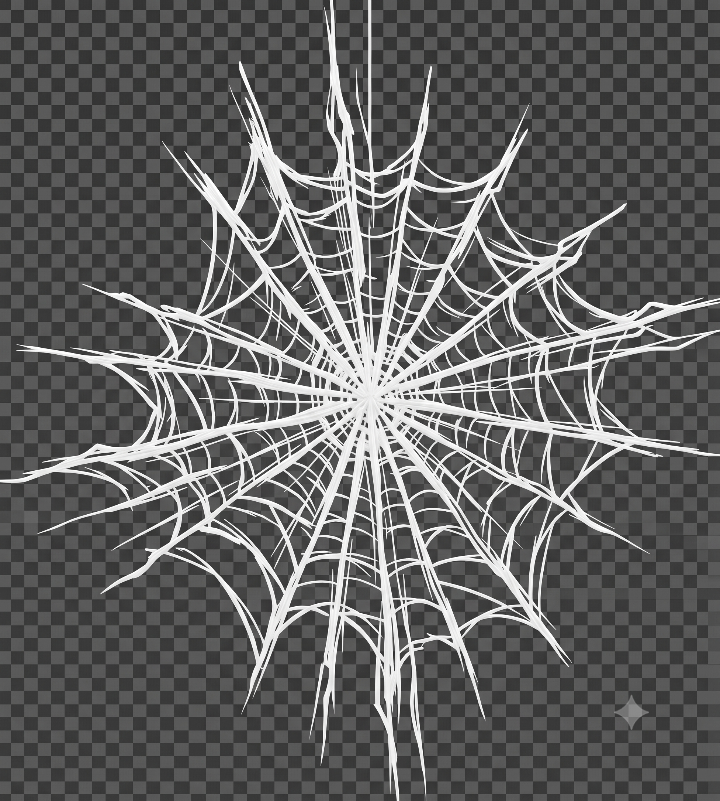

# 🕷️ SPYDY — Tiru Venkatesh

<div align="center">



# TIRU

### AI ENGINEER • BUILDER • CREATOR

**Building AI. Shipping Products.**

A cinematic, interactive developer portfolio inspired by the world of Spider-Man.

<br>

[](https://github.com/tiru-venkatesh)
[](https://www.linkedin.com/in/tiru-venkatesh-830907202/)
[](#)

</div>

---

# 🕷️ SPYDY

**SPYDY** is my personal interactive developer portfolio.

I didn't want to build another portfolio that looks like:

> Hero section → About → Skills → Projects → Contact.

Instead, I wanted to create something that feels like an **experience**.

A portfolio that combines:

- 🕷️ Spider-Man inspired visual identity
- 🎬 Cinematic storytelling
- ⚡ Scroll-driven interactions
- 🕸️ Web animations
- 🎨 Dark cinematic UI
- 💻 Developer-focused content
- 🧠 AI Engineer branding
- 🚀 Real projects and experiments

The idea is simple:

> **Don't just tell people what I build. Let them experience it.**

---

# ⚡ THE IDEA

SPYDY is built around one concept:

```text
PORTFOLIO
    ↓
EXPERIENCE
    ↓
STORY
    ↓
INTERACTION
    ↓
IDENTITY

Every section is designed to feel like part of the same journey.

The user doesn't simply browse a list of information.

They move through the story.

🎬 EXPERIENCE FLOW

The portfolio is designed as a cinematic sequence.

                START
                  │
                  ▼
        ┌──────────────────┐
        │   TIRU           │
        │   INTRODUCTION   │
        └────────┬─────────┘
                 │
                 ▼
        ┌──────────────────┐
        │   AI ENGINEER    │
        └────────┬─────────┘
                 │
                 ▼
        ┌──────────────────┐
        │ BUILDING AI      │
        │ SHIPPING PRODUCTS│
        └────────┬─────────┘
                 │
                 ▼
        ┌──────────────────┐
        │     ABOUT        │
        └────────┬─────────┘
                 │
                 ▼
        ┌──────────────────┐
        │     SKILLS       │
        └────────┬─────────┘
                 │
                 ▼
        ┌──────────────────┐
        │    PROJECTS      │
        └────────┬─────────┘
                 │
                 ▼
        ┌──────────────────┐
        │    CONTACT       │
        └──────────────────┘
🕸️ WHY SPIDER-MAN?

Spider-Man is not just a visual reference.

The character represents:

Curiosity
Experimentation
Failure
Adaptation
Responsibility
Constant improvement

Those ideas are strongly connected to how I approach building software.

I learn something.

I experiment with it.

I break things.

I fix them.

I ship.

Then I build again.

That's the philosophy behind SPYDY.

👨‍💻 ABOUT ME

I'm Tiru Venkatesh, a Computer Science student focused on becoming an AI Engineer.

My interests are centered around building intelligent systems and turning AI capabilities into useful products.

My current focus
Artificial Intelligence
Machine Learning
Large Language Models
Generative AI
RAG Systems
AI Agents
Computer Vision
AI-powered Applications
Full-Stack Development
Product Engineering

I'm particularly interested in the intersection between:

AI
+
Software Engineering
+
Product Building

The long-term goal isn't simply to learn technologies.

It's to use them to build real products that people can actually use.

🧠 AI ENGINEERING DIRECTION

My learning path is increasingly focused on understanding AI systems deeply rather than simply calling an API.

Machine Learning
      ↓
Deep Learning
      ↓
Transformers
      ↓
LLMs
      ↓
Embeddings
      ↓
RAG
      ↓
AI Agents
      ↓
AI Systems
      ↓
AI Products

The goal:

Understand the engine, then build the machine.

🛠️ TECHNOLOGY STACK
Programming Languages

🤖 AI / ML

🌐 WEB DEVELOPMENT

☁️ TOOLS & PLATFORMS

🧩 PORTFOLIO ARCHITECTURE

The current portfolio intentionally uses a lightweight architecture.

                 SPYDY
                   │
        ┌──────────┼──────────┐
        │          │          │
        ▼          ▼          ▼
      HTML        CSS       JavaScript
        │          │          │
        │          │          │
        └──────────┼──────────┘
                   │
                   ▼
             Visual Assets
                   │
          ┌────────┼────────┐
          │        │        │
          ▼        ▼        ▼
       Images     Web      Video

No unnecessary framework overhead.

The objective is maximum control over:

Animation
Layout
Timing
Visual transitions
Interaction
Performance
🗂️ PROJECT STRUCTURE
spydy-portfolio/
│
├── assets/
│   │
│   ├── bgskills.png
│   ├── dream-big.jpg
│   ├── gate-visual.jpg
│   │
│   ├── landing-1.jpg
│   ├── landing-2.jpg
│   ├── landing-3.jpg
│   │
│   ├── web-shooter.mp4
│   ├── web-sketch.png
│   └── web.png
│
├── index.html
├── style.css
├── script.js
└── README.md
🎥 CINEMATIC LANDING

The landing experience is built around three visual states.

FRAME 01
TIRU

The introduction.

FRAME 02
AI ENGINEER

The identity.

FRAME 03
BUILDING AI.
SHIPPING PRODUCTS.

The mission.

🖼️ LANDING BACKGROUNDS

The three primary landing images are:

assets/landing-1.jpg
assets/landing-2.jpg
assets/landing-3.jpg
landing-1.jpg

Used behind:

TIRU
landing-2.jpg

Used behind:

AI ENGINEER
landing-3.jpg

Used behind:

BUILDING AI.
SHIPPING PRODUCTS.
🎨 VISUAL DIRECTION

The portfolio uses a cinematic visual language.

Primary characteristics
Dark backgrounds
High contrast
Crimson accents
Large typography
Full-screen imagery
Strong shadows
Motion
Negative space
Minimal UI

The background treatment intentionally pushes images toward a darker cinematic look.

This allows the typography and animations to remain the primary focus.

🕸️ WEB-SHOOTER SYSTEM

SPYDY also includes custom web-shooter inspired visual assets.

assets/web-shooter.mp4
assets/web.png
assets/web-sketch.png

These are used as part of the Spider-Man inspired interaction system.

The objective is not to make the portfolio look like a Spider-Man fan page.

The objective is to translate the feeling of web movement and momentum into a developer experience.

⚡ INTERACTION PHILOSOPHY

Animations are not added simply because they look cool.

Each animation should have a purpose.

Scroll
  ↓
Movement
  ↓
Transition
  ↓
Story

The interaction should answer:

Why is this moving?

If an animation doesn't improve the experience, it doesn't belong.

📱 RESPONSIVE DESIGN

The portfolio is designed to work across:

Desktop
Laptop
Tablet
Mobile

Special attention is required for:

Full-screen backgrounds
Typography scaling
Video assets
Scroll interactions
Touch interactions
Image cropping
Performance
🚀 RUN LOCALLY
1. Clone the repository
git clone https://github.com/tiru-venkatesh/spydy-portfolio.git
2. Enter the project
cd spydy-portfolio
3. Run a local server

Using Python:

python -m http.server 8000

Then open:

http://localhost:8000
💻 VS CODE

You can also open the project in VS Code.

Open Folder
     ↓
spydy-portfolio
     ↓
Open index.html
     ↓
Run with Live Server
🧪 DEVELOPMENT

The project is intentionally simple to modify.

HTML

Responsible for:

Structure
Sections
Content
Elements
CSS

Responsible for:

Layout
Typography
Animations
Transitions
Visual effects
Responsive behaviour
JavaScript

Responsible for:

Interactions
Scroll behaviour
Dynamic effects
Web animations
Portfolio logic
🛠️ CUSTOMIZATION
Change landing images

Replace:

assets/landing-1.jpg
assets/landing-2.jpg
assets/landing-3.jpg

Keep the same filenames.

Change landing text

Open:

index.html

and modify the hero content.

Change animations

Open:

script.js
Change visual styling

Open:

style.css
📸 IMAGE GUIDELINES

For the best cinematic effect, landing images should ideally have:

Dark backgrounds
Side lighting
Back lighting
Strong shadows
Minimal clutter
Subject near the center
Vertical or portrait framing
Consistent lighting

Recommended minimum:

1600px+

on the long edge.

⚡ PERFORMANCE

Large visual assets can significantly affect loading performance.

The biggest asset in the project is the web-shooter video.

For production deployment, optimization should include:

Video compression
Image compression
Lazy loading
Modern image formats
Reduced video size
Mobile-specific assets

Future versions may use:

WebP
AVIF
Compressed MP4
WebM
Responsive images
🧠 PROJECT PHILOSOPHY

SPYDY follows five principles.

01 — BUILD

Don't just consume.

Build.

02 — EXPERIMENT

Try ideas that haven't been done before.

03 — BREAK

Things will fail.

That's part of engineering.

04 — LEARN

Every failure gives information.

05 — SHIP

A finished imperfect product is more valuable than an unfinished perfect idea.

🔥 BUILDING IN PUBLIC

This portfolio is not supposed to represent a finished version of me.

It's a snapshot of the journey.

As I learn:

AI
LLMs
Agents
RAG
Machine Learning
Product Engineering

the portfolio will evolve.

New projects will replace old experiments.

New ideas will replace old designs.

The website will keep changing.

🚧 CURRENT STATUS
╔══════════════════════════════════════╗
║           SPYDY STATUS               ║
╠══════════════════════════════════════╣
║ Cinematic Landing       ██████████ 100% ║
║ Visual System           █████████░  90% ║
║ Scroll Experience       ████████░░  80% ║
║ Web Interactions        ████████░░  80% ║
║ About Section           ███████░░░  70% ║
║ Skills Experience       ███████░░░  70% ║
║ Projects Showcase       █████░░░░░  50% ║
║ AI Case Studies         ███░░░░░░░  30% ║
║ Advanced Interactions   ██░░░░░░░░  20% ║
╚══════════════════════════════════════╝
🗺️ ROADMAP
Phase 01 — Foundation
 Project structure
 Cinematic landing
 Three-stage hero experience
 Background image system
 Dark cinematic styling
 Web assets
 Scroll interactions
Phase 02 — Identity
 Personal branding
 AI Engineer positioning
 Complete About experience
 Experience timeline
 Achievements
 Education section
Phase 03 — Projects
 Project cards
 Project case studies
 Live demos
 GitHub integration
 Technical architecture
 Project metrics
Phase 04 — AI Engineer Mode
 LLM projects
 RAG projects
 AI Agent projects
 ML experiments
 AI architecture diagrams
 Technical articles
 AI experiment log
Phase 05 — Advanced Experience
 Advanced scroll animations
 Web-swing navigation
 Interactive project transitions
 More cinematic sequences
 Advanced mobile interactions
 Performance optimization
🧪 EXPERIMENT LAB

SPYDY also acts as a frontend experimentation playground.

Things I can experiment with here:

Scroll-driven animation
Motion design
Video transitions
CSS effects
Canvas
WebGL
Interactive storytelling
Micro-interactions
3D interfaces
AI-powered UI
Creative coding

Some experiments may never make it into the final portfolio.

That's okay.

Experiments are how better ideas are discovered.

🏗️ BEYOND THE PORTFOLIO

SPYDY is only one part of my larger journey.

My broader direction is:

             LEARN
               ↓
            EXPERIMENT
               ↓
             BUILD
               ↓
             SHIP
               ↓
             SHARE
               ↓
            IMPROVE
               ↓
             REPEAT

The end goal is not:

"Become good at coding."

It's:

Become someone who can take an idea
and turn it into a real product.
🎯 MY CURRENT MISSION
LEARN AI DEEPLY
       +
BUILD REAL SYSTEMS
       +
SHIP PRODUCTS
       +
CREATE IN PUBLIC

That's the direction.

🌐 LINKS
GitHub

https://github.com/tiru-venkatesh

LinkedIn

https://www.linkedin.com/in/tiru-venkatesh-830907202/

Creator

@lockintiru

⭐ SUPPORT

If you like the project:

⭐ Star the repository
🍴 Fork it
🧪 Experiment with it
💡 Build something better

If you find something interesting or broken, feel free to open an issue.

🤝 CONTRIBUTING

This is primarily a personal portfolio, but ideas, suggestions, and improvements are welcome.

If you want to experiment with the project:

git clone https://github.com/tiru-venkatesh/spydy-portfolio.git
cd spydy-portfolio

Create your own branch:

git checkout -b feature/your-feature

Make your changes and submit a pull request.

📜 LICENSE

This project is currently intended as a personal portfolio project.

The source code is available for learning and experimentation.

Please do not directly copy the complete portfolio and present it as your own work.

🕷️ FINAL THOUGHT

Most portfolios say:

"Here are my skills."

SPYDY tries to say:

"Here is what I can create."

Because ultimately...

Skills are learned.

Projects are built.

Products are shipped.

Stories are remembered.
<div align="center"> 
🕷️ SPYDY
TIRU VENKATESH

AI ENGINEER

BUILDING AI. SHIPPING PRODUCTS.

<br>

━━━━━━━━━━━━━━━━━━━━━━━━━━━━━━━━━━━━

Built with curiosity.
Powered by code.
Driven by AI.

━━━━━━━━━━━━━━━━━━━━━━━━━━━━━━━━━━━━

</div> ```
